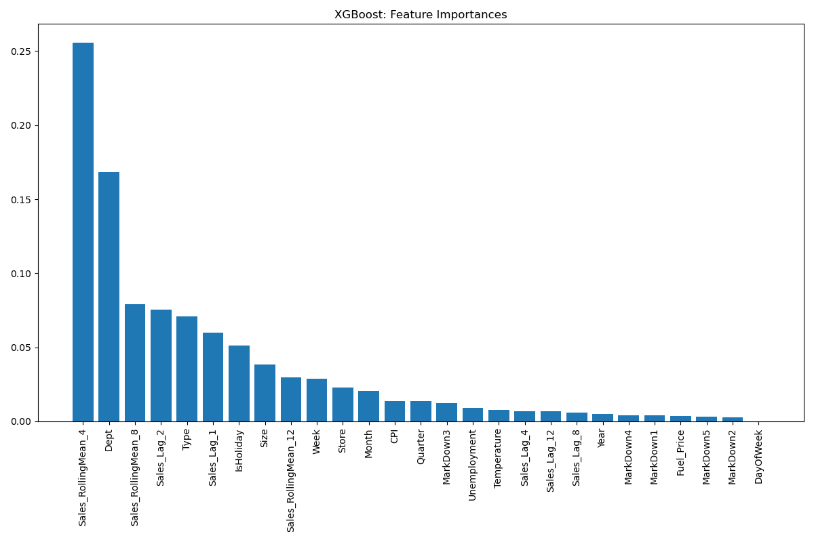

# Boosting vs Neural Networks: XGBoost Leads in Walmart Time Series Forecasting
The project will use ML/DL to forecast sales and demand based on sample data from Walmart stores while taking into account economic conditions like the Consumer Price Index (CPI), unemployment rate (Unemployment Index, etc). In this project, I want to try a new package called **Optuna**. Optuna is an open-source hyperparameter optimization framework developed by Preferred Networks, Inc. It provides a flexible and efficient platform for optimizing machine learning model hyperparameters, allowing users to find the best set of hyperparameters for their models automatically.

## Key findings
- XGBoost performs best overall, with the most accurate and consistent predictions
- Time-based features (like rolling means) and department are crucial for predictions.
- Some features at the bottom (e.g., MarkDown2, DayOfWeek) have very little impact on predictions.

# Now let's dive into the analysis

## Environment

- Machine: MacBook with M3 Pro chip (MPS device used for GPU acceleration)
- Python version: 3.9
- Main libraries: PySpark 3.4.1, PyTorch 1.9.0+

## Setup and Installation

1. Clone the repository
   ```
   git clone https://github.com/peeti-sriwongsanguan/time_series_walmart.git
   ```
2. Create a virtual environment & Install the required packages:
   ```
   conda env create -f environment.yml && conda activate walmart-timeseries && conda update -y -n base -c conda-forge conda
   ```

## Requirements

- Python 3.7+
- Java 8 or later
- Torch

## Project Structure

```
walmart-timeseries/
│
├── data/
│   └── walmart_cleaned.csv
├── image/
│   └── *.png
│
├── src/
│   ├── __init__.py
│   ├── data_processing.py
│   ├── model.py
│   ├── plot_image.py
│   └── utils.py
│
├── environment.yml
├── main.py
├── requirements.txt
├── .gitignore
└── README.md
```

4. Make sure your `walmart_cleaned.csv` file is in the `data/` directory.

5. Run the main script:
   ```
   python main.py
   ```
   
## Data Preprocessing
   - Added more feature engineering, including day of week and quarter.
   - Introduced lag features and rolling mean features to capture time-dependent patterns.

## Data Splitting:

Implemented TimeSeriesSplit for more appropriate evaluation of time series data.
Added feature scaling using StandardScaler.

## ARIMA VS SARIMA

**ARIMA** takes into account the past values (autoregressive, moving average) and predicts future values based on that. **SARIMA** similarly uses past values but also takes into account any seasonality patterns. Since SARIMA brings in seasonality as a parameter, it’s significantly more powerful than ARIMA in forecasting complex data spaces containing cycles.

## XGBoost Optimization:

Integrated Optuna for hyperparameter tuning of the XGBoost model.

   #### The Principal behind Optuna (Kevin Akbari)

   *Optuna employs an optimization algorithm called Tree-structured Parzen Estimator (TPE), which is good for optimizing hyperparameters with discrete and continuous search spaces. The TPE algorithm models the relationship between hyperparameters and the objective function (e.g., model performance metric) using a tree structure, and then uses this model to efficiently explore the search space and find the optimal hyperparameters.*

## Deep Learning Models:

Created a generic training and evaluation function for all PyTorch models.
Moved model definitions into separate classes for better organization.


## Error Handling and Flexibility:

Added basic error handling and made the code more flexible for different datasets.


## Performance Improvements:

Used 'cuda' device for PyTorch models if available, which can significantly speed up training on GPUs.


### Model Comparisons: 


From the model comparisons, you can see that all models struggle with very high sales values, XGBoost performs best in this range. XGBoost's predictions closely aligned with actual values but it gives slight overprediction for high sales. Whereas CNN model's predictions mostly below 70,000
and gives better performance for lower sales values.

#### Predictions vs Actual

<table>
  <tr>
    <td></td>
    <td></td>
    <td></td>
  </tr>
  <tr>
    <td align="center">CNN Model</td>
    <td align="center">Ensemble Model</td>
    <td align="center">XGBoost Model</td>
  </tr>
</table>


#### Model Residual Distribution
<table>
  <tr>
    <td></td>
    <td></td>
    <td></td>
  </tr>
  <tr>
    <td align="center">CNN Model</td>
    <td align="center">Ensemble Model</td>
    <td align="center">XGBoost Model</td>
  </tr>
</table>


## Ensemble Method:

Added a commented-out section for ensemble predictions, which often improve overall performance.

## Feature Selections



## The top 3 most important features are:

1. **Sales_RollingMean_4** (likely a 4-week rolling average of sales):

   This is like a "recent sales trend" indicator. Imagine looking at the average sales for the past 4 weeks. It gives us a sense of how the store has been performing very recently. It's important because it captures short-term patterns or fluctuations in sales that might be continuing into the near future.
2. **Dept (department):**

   This refers to the different sections or categories within a store, like groceries, electronics, or clothing. Its high importance tells us that sales patterns vary significantly across different departments. For example, the model recognizes that predicting sales for the toy department might be very different from predicting sales for the fresh produce department.
3. **Sales_RollingMean_8** (likely an 8-week rolling average of sales):

   This is similar to the first feature, but it looks at a longer time frame - the average sales over the past 8 weeks. It's like a "medium-term sales trend" indicator. This captures slightly longer-term patterns that might be influencing sales, such as seasonal trends that last for a couple of months.


